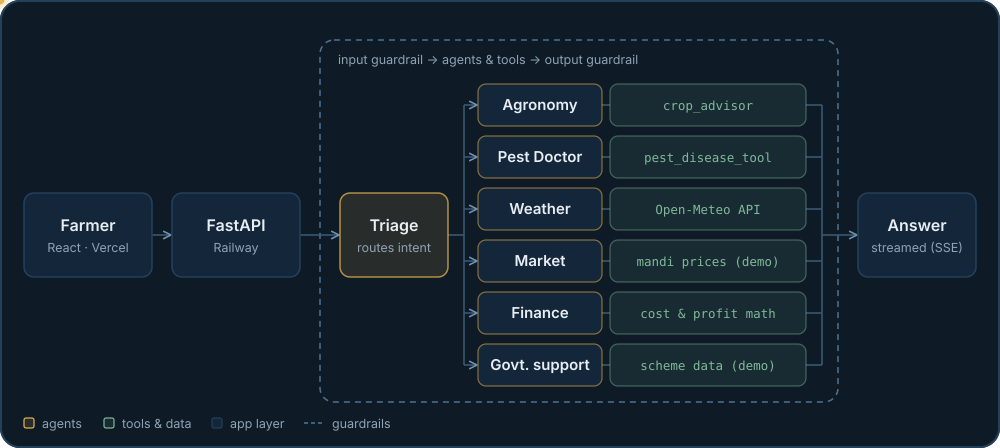
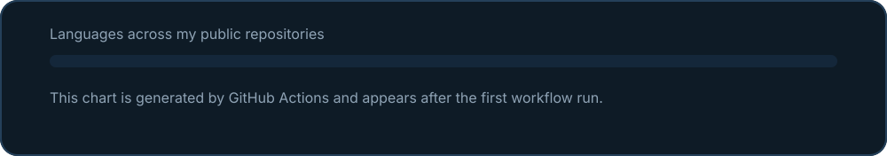

 

**I build AI agents that use tools, follow guardrails, and ship to the web.**

[Kisan Dost live](https://kisan-dost-alpha.vercel.app) &nbsp;•&nbsp; [InsightOS live](https://insight-os-taupe.vercel.app) &nbsp;•&nbsp; [KaamFix live](https://kaamfix.vercel.app) &nbsp;•&nbsp; [All repositories](https://github.com/AhmadIshaq-code?tab=repositories)

## Right now

- **Building:** tool-using AI agents, RAG apps, and full-stack products.
- **Learning:** multi-agent systems in more depth, MCP, and scalable backends.
- **Studying:** BS Computer Science, University of Agriculture Faisalabad.

## Featured work

The roadmap in my Weather & News Agent listed specialist agents, handoffs, guardrails, sessions, FastAPI, and cloud deployment. Kisan Dost is where I built them.

### Kisan Dost

**A multi-agent farming assistant for Pakistani farmers.**
[Live demo](https://kisan-dost-alpha.vercel.app) • [Source](https://github.com/AhmadIshaq-code/kisan-dost) • [Demo video](https://drive.google.com/file/d/1-62ahWog5dlVFlNfrxHPzon-UlQXH6kZ/view?usp=sharing)

**Problem.** One farming decision touches crops, pests, weather, prices, costs, and support schemes at once. A single chatbot blends them together and can't be trusted with the math.

**Solution.** A triage agent routes each question to one of six specialist agents. Tools and plain code handle facts and calculations. Guardrails check what goes in and what comes out.

- Understands Urdu, Roman Urdu, and English
- Agent handoffs, function tools, per-farmer context, and SQLite session memory, built on the OpenAI Agents SDK
- Streams answers over SSE, with the React frontend on Vercel and the FastAPI backend on Railway
- Guardrails keep it from inventing pesticide doses, and fertilizer and profit figures come from code, not from the model

`Python` `FastAPI` `OpenAI Agents SDK` `Groq` `Pydantic` `React` `TypeScript`

**Status:** functional prototype. Market prices and government-scheme data are demo datasets, and the repo says so.

### InsightOS

**Ask questions across company documents and business data in one place.**
[Live demo](https://insight-os-taupe.vercel.app) • [Source](https://github.com/AhmadIshaq-code/InsightOS)

**Problem.** Policies live in PDFs, numbers live in spreadsheets, and one question often needs both.

**Solution.** A router classifies each question as DATA, DOCS, or HYBRID. Document questions run through local vector search and come back with citations.

- PDF ingestion and chunking, local embeddings (`all-MiniLM-L6-v2`), and a Chroma vector store
- Groq-hosted Llama 3.3 70B for answers, with expandable source citations
- React 19 interface with drag-and-drop upload and Recharts visualizations

`Python` `FastAPI` `Chroma` `sentence-transformers` `Groq` `React` `Vite`

**Status:** Phase 1 foundation is complete. Excel ingestion, DuckDB analytics, and dashboards are on the roadmap.

### KaamFix

**A local services marketplace with an AI service advisor.**
[Live demo](https://kaamfix.vercel.app) • [Source](https://github.com/AhmadIshaq-code/kaamfix)

**Problem.** Customers and local workers need one place to find each other, request work, and build trust through reviews.

**Solution.** A full-stack platform with role-based accounts for customers and workers, service requests, reviews and ratings, notifications, dashboards, and an AI Service Advisor powered by Gemini.

`React` `TypeScript` `Vite` `Firebase` `Gemini` `Vercel`

### Earlier steps

- **[Weather & News Agent](https://github.com/AhmadIshaq-code/weather-agent-openai-agents-sdk):** a small tool-calling agent I built to learn the OpenAI Agents SDK. It decides whether to call a weather tool, a news tool, or both, then combines the results. `Python` `OpenAI Agents SDK` `Groq`
- **[Marriage Hall Management System](https://github.com/AhmadIshaq-code/MarriageHallManagementSystem):** a C# desktop app for bookings, customers, staff, and invoices, built in three layers with hashed passwords. `C#` `MySQL`

## How I build

> Don't just build demos. Build systems that solve real problems.

- **Let the model handle language and let code handle facts.** Calculations run in deterministic code, not in a prompt.
- **Route to specialists.** Several small agents with clear jobs beat one giant prompt.
- **Guard both sides of the model.** Check the input before it reaches an agent and the output before it reaches a person.
- **Call a prototype a prototype.** Demo data is labeled as demo data, and limitations are written down.

## Stack

| Area | What I use |
| :-- | :-- |
| **Agents & LLMs** | OpenAI Agents SDK (handoffs, function tools, guardrails, sessions), Groq (gpt-oss-20b, Llama 3.3 70B), Gemini |
| **RAG & data** | Chroma, sentence-transformers, PyMuPDF, Pydantic |
| **Backend** | Python, FastAPI, REST and SSE, SQLite, MySQL |
| **Frontend** | React, TypeScript, Vite, Tailwind CSS, Recharts |
| **Cloud & tools** | Firebase, Vercel, Railway, Git, GitHub, VS Code |
| **Also written** | C#, JavaScript, HTML, CSS |

## Learning next

- Multi-agent systems in more depth
- RAG and LLM applications beyond my first MVP
- MCP and AI tool integration
- AI automation
- Scalable backend architecture

On the Kisan Dost roadmap: Urdu voice input, crop-photo diagnosis, and a production database with authentication.

## Languages

Generated weekly from my public repositories by [a small GitHub Actions workflow](.github/workflows/profile-assets.yml).

## Connect

The code and live demos above are the best picture of how I work. To get in touch, [follow me on GitHub](https://github.com/AhmadIshaq-code).

<!--
Add contact links here when you're ready to share them, for example:
[LinkedIn](https://www.linkedin.com/in/YOUR-HANDLE) • [Email](mailto:you@example.com)
-->

Learn, build, experiment, ship.

